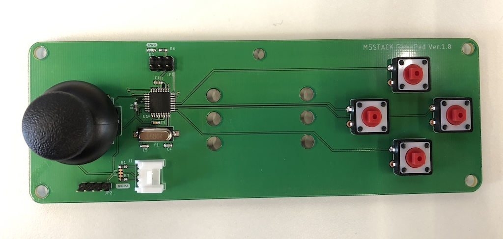

# M5Stack_GamePad
### M5Stack용 Gamepad
- I2C 디바이스로 동작함
- M5Stack의 I2C포트에 연결이 되어 조이스틱의 값 및  버튼입력 값을 받을 수 있다.
- M5Stack용 Joystck과 사용법이 같다. https://docs.m5stack.com/#/en/unit/joystick
- 차이점은
    - requestFrom 함수의 인자값을 3 대신 4로 입력한다.
    - 키 버튼의 맵핑은 
    ```cpp
        void loop() {
        // put your main code here, to run repeatedly:
        Wire.requestFrom(JOY_ADDR, 4);
        if (Wire.available()) {
            x_data = Wire.read();
            y_data = Wire.read();
            select_data = Wire.read(); // Joystick button
            btn_data = Wire.read();    // Keypad button: up, down, left, right
                
            sprintf(data, "x:%d y:%d button:%d\n", x_data, y_data, select_data);
            Serial.print(data);

            if (btn_data & UP) Serial.println("UP");
            if (btn_data & DOWN) Serial.println("DOWN");
            if (btn_data & LEFT) Serial.println("LEFT");
            if (btn_data & RIGHT) Serial.println("RIGHT");                
        }
        delay(200);
        }
    ```

- History
    - Version 1.0
        
        
    - Version 1.1
        - I2C 포트의 위치 변경
        - 홀 사이즈 변경
        - PCB 레이아웃 변경
